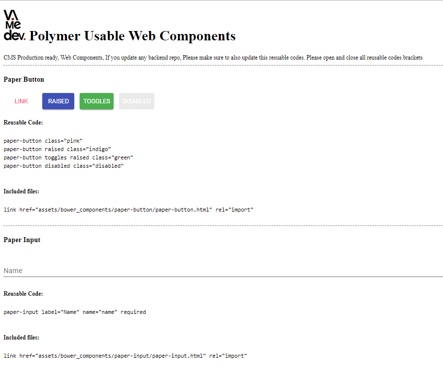
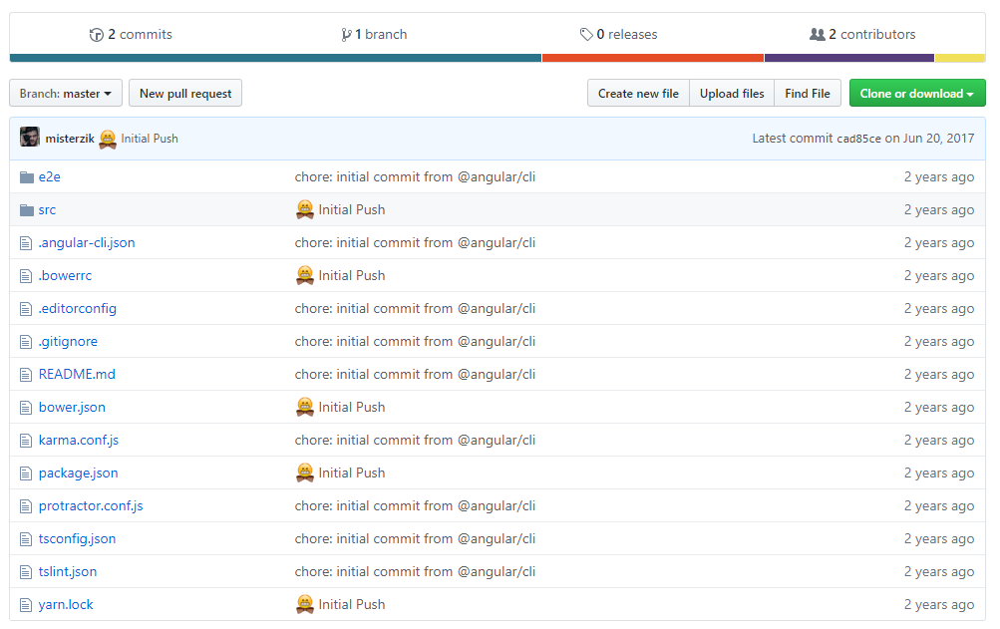

# Angular4 + Polymer 

AngularJS and Jade for Front-end with SocketIO wrapped around express. 

## Getting Started

Make sure to have Node.JS installed in your system with NPM.

 1) Grab the dependencies with npm:

    `npm install`

2) If any Angular dependencies through bower, you will need bower, you can get it through npm, (https://bower.io/) by using

    `npm install -g bower`
To install Globally in your System.

3) after installing bower then do on the command line.

    `bower install`

## Development server

Run `ng serve` for a dev server. Navigate to `http://localhost:4200/`. The app will automatically reload if you change any of the source files.

## Code scaffolding

Run `ng generate component component-name` to generate a new component. You can also use `ng generate directive|pipe|service|class|module`.

## Build

Run `ng build` to build the project. The build artifacts will be stored in the `dist/` directory. Use the `-prod` flag for a production build.

## Legacy Dependencies :

1) Angular 4
2) Polymer 2

### History Snapshot:

